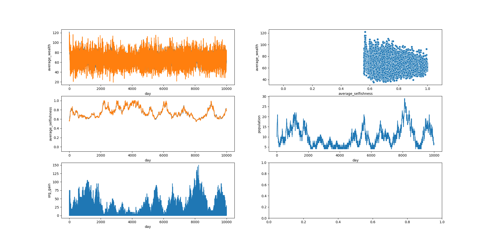
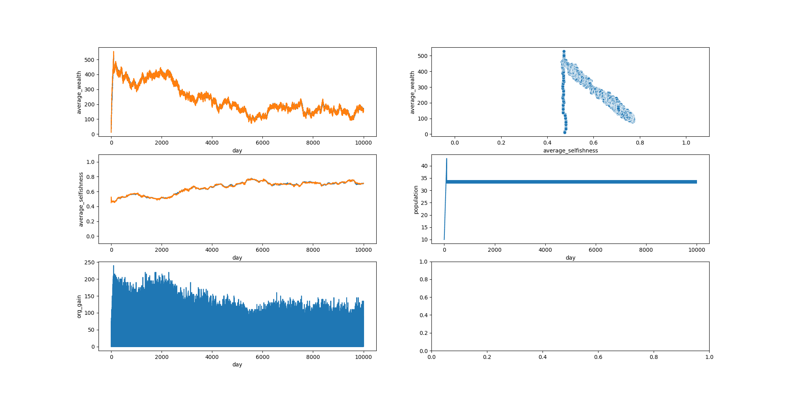
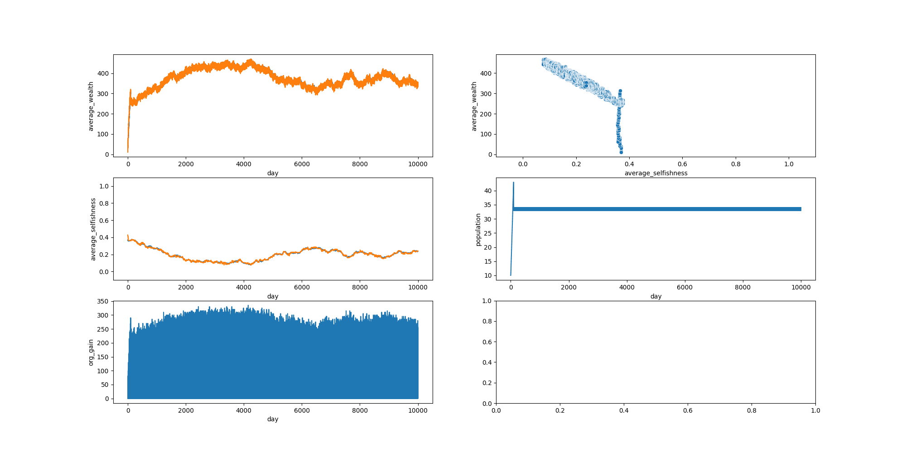

### Let's try to simulate organizational dynamics

#### Intro

I've been thinking about how actions that employees take can affect both themselves, others, and the company as a whole. I've been wanting to make some kind of model/simulation of this for a while now, so let's try it. Bonus points for doing this as a toy project in Go!

#### The Model

What is an organization?

First and foremost, we can think of it as a collection of _people_. People are entities, who aim to optimize their own _personal gain_. The basic premise of an organization is that, in theory, it should be able to increase the personal gain of all the people inside it more than compared to if everyone acted individually. 

Let's consider a simple organization. We have $N$ _people_, and every day each of them can choose to act in one of two ways:

1. Act in favor of oneself - generate $X$ personal gain.
2. Act in favor of the Org - generate $Y<X$ personal gain.

Each person starts with $S$ initial personal gain, and every day they lose $Z$ personal gain.

Every D days the Org generates  $L = nkY$ gain, where:

- $n$ - the number of times someone acted in favor of the organization
- $k$ - a pre-defined coefficient

which is then equally divided among its participants.

#### I tried it

https://github.com/Stealthmate/orgsim/tree/061d5d5d78d96f7f8d5f7a32268be7c39248b71a

```
initial_people={Person() for _ in range(10)},
profit_period=3,
profit_coef=5,
initial_personal_gain=120,
selfish_gain=10,
selfless_gain=5,
daily_loss=20,
periodic_recruit_count=1,
max_age=100
```

Using these conditions, I get this kind of result:



Even though selfishness is prioritized, population is still fluctuating, which possibly implies that the world is too hard. Doing the math, we can see that even in a fully selfless organization, a person gains $5 * (3 + 5) \div 3 \approx 13.33$ gain per day, which is not enough to offset the daily loss.

Let's try with different conditions.

```
initial_people={Person() for _ in range(10)},
profit_period=3,
profit_coef=5,
initial_personal_gain=20,
selfish_gain=6,
selfless_gain=5,
daily_loss=10,
periodic_recruit_count=1,
max_age=100
```

In this case, a fully selfless society should out-perform a society with selfish players. And yet, we see this:



It is clear that selfishness and average wealth are negatively correlated, yet the organization seems to be doing just fine. I suspect this is because, right now, selfish people also get a portion of the Org's gain, even if they haven't contributed anything. In other words, selfless people are earning gain both for themselves _and_ for the selfish ones.

Let's try again.

```
initial_people={Person() for _ in range(10)},
profit_period=3,
profit_coef=3,
initial_personal_gain=20,
selfish_gain=6,
selfless_gain=5,
daily_loss=10,
periodic_recruit_count=1,
max_age=100
```

This time I reduced the Org gain reward (`profit_coef`). This means that selfless people earn less gain, which should provide more incentive for the world to prioritize selfless people.

And voila!



---

Enough for today. Next I should try to change how Org gain is redistributed. I can think of a few different ideas:

- Equal distribution, regardless of contribution (current)
- Distribution based on number of contributions during the period
- Distribution based on total contributions so far

I should probably refactor the code so that this kind of logic is more easily implemented. Something-something strategy pattern, most likely.