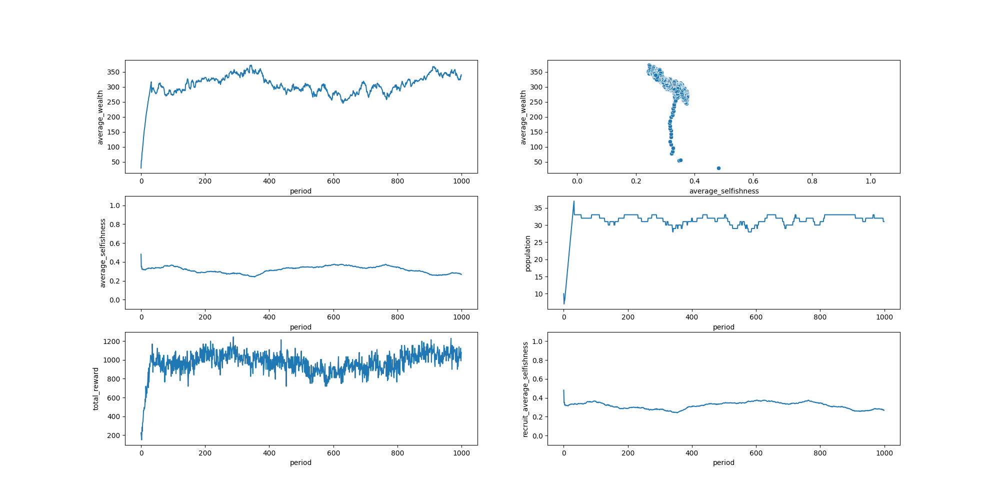

Previously we distributed rewards equally for everyone, regardless of how much they contributed to the Org (or whether they contributed at all). This incentivzes some people to be selfish - as long as the selfish people are not too many, they can live off the contributions of the selfless. So next I decided to implement reward distribution based on each individual's contribution.

What I did is simple - the total rewards are split so that each person receives an amount proportional to the times he or she contributed to the Org. This implies that people who did not contribute receive zero reward.

Then I ran the simulation.

https://github.com/Stealthmate/orgsim/commit/fe5a1127ae1719510b45fc23fb3cc12af226f82f

```
initial_people={common.Person() for _ in range(10)},
profit_period=3,
profit_coef=3,
initial_personal_gain=20,
selfish_gain=6,
selfless_gain=5,
daily_loss=10,
periodic_recruit_count=1,
max_age=100,
# reward_distribution_strategy=reward_distribution.AllEqual(),
reward_distribution_strategy=reward_distribution.EqualContribution(),
```



It seems that the results are more or less the same as before...

I'm not sure why this happens, but before investigating further I'd like to refactor the code a bit more. I think I should change the names of some of the parameters to better reflect what they represent, e.g. renaming `gain` to `reward`, giving a better name to the `profit_*` values, etc. Also, I should probably find a way to represent the "harshness of the world" using less values (right now I have initial reward, daily loss, selfish/selfless gain, etc.)
