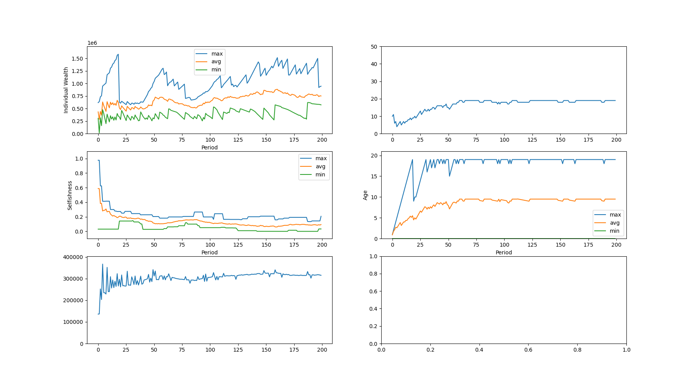
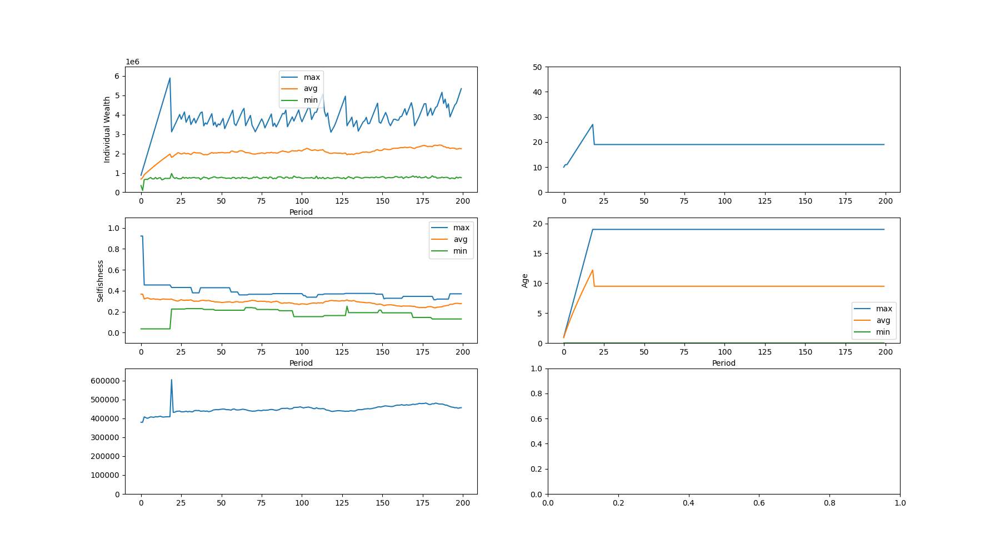

I refactored the code a lot more and set up a framework for measuring how everything is performing. I also renamed some of the variables. But the more I work on this the more confused I get. What am I trying to find out, exactly?

Maybe I should set the parameters to something that resembles the real world a bit more.

---

commit: `e40d6382adc2a6a7eebdfb4b9f423ed489a68942`

I refactored yet again, and this time I started using real life values - salary, living cost, fiscal period, etc. This lead to some interesting results.

```
initial_people:
  - identity: "6"
    selfishness: 0.6366064814815763
  - identity: "2"
    selfishness: 0.27676605078421046
  - identity: "3"
    selfishness: 0.4145108440926233
  - identity: "10"
    selfishness: 0.9760348163550328
  - identity: "5"
    selfishness: 0.709411391063176
  - identity: "9"
    selfishness: 0.9599962021915778
  - identity: "4"
    selfishness: 0.9116951551722613
  - identity: "1"
    selfishness: 0.3782429830212608
  - identity: "8"
    selfishness: 0.5845002085682561
  - identity: "7"
    selfishness: 0.030527587406643852
fiscal_length: 365
productivity: 1.1
initial_individual_wealth: 600000.0
daily_salary: 821.917808219178
daily_living_cost: 1643.835616438356
periodic_recruit_count: 1
max_age: 7300
```



```
initial_people:
  - identity: "5"
    selfishness: 0.9221152840383604
  - identity: "10"
    selfishness: 0.34396375376812405
  - identity: "1"
    selfishness: 0.18837589427579493
  - identity: "4"
    selfishness: 0.3445369716533304
  - identity: "6"
    selfishness: 0.036188434524981106
  - identity: "2"
    selfishness: 0.1898658096296002
  - identity: "8"
    selfishness: 0.31519239198495586
  - identity: "3"
    selfishness: 0.45517949759829734
  - identity: "9"
    selfishness: 0.43709752060860085
  - identity: "7"
    selfishness: 0.4359540585537376
fiscal_length: 365
productivity: 2.0
initial_individual_wealth: 600000.0
daily_salary: 821.917808219178
daily_living_cost: 1643.835616438356
periodic_recruit_count: 1
max_age: 7300
```



The difference between these two is the value of `productivity`, that is to say, the coefficient by which "profit" is calculated relative to "work" (profit = productivity times everyone's contribution).

I also changed how contribution works. Previously everyone contributed a set amount, but the decision whether to contribute or not was decided by a coin toss based on selfishness. This time I implemented it so that people contribute every day, but the amount is proportional to the value of selfishness, i.e. selfish people contribute less and vice versa. Every day, each person's contribution coefficient (= their selfishness) is counted towards a tally, and then profits are redistributed based on people's ratios. (see code for more details.)

We can clearly see that higher productivity results in people being more selfish, due to the fact that they can survive in the world more easily.

I wonder what I should try out next. Maybe I should fiddle with the recruitment process. Right now it's extremely simplistic. I could try making it so that the organization recruits people who are similar to the "best performers". **But then what are the "best performers"? How can I evaluate the organization as a whole?**