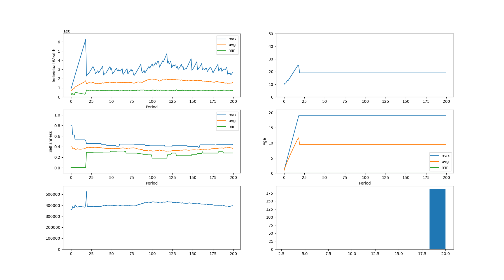
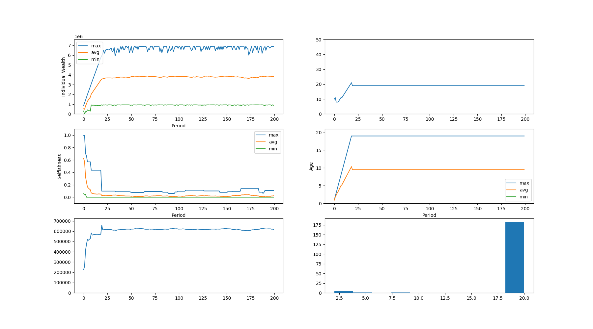

- log life of people (per-person metrics)
- deciding on reward distribution is practically the essence of management itself
- Rewarding the people who contributed most to the org would naturally pick the most selfless people. **But how good is this for _them_?**

---

OK, so I refactored a lot of the code again and created a proper abstraction for defining recruitment strategies. Then I implemented 2 of those:
1. Recruit based on the average of all remaining people
2. Recruit based on the people who contributed most in the last period

#### Results

Commit: `aa219776e3e8d35f27d739230244fb8b33024607`

#####  `AverageOfEveryone`

```python
id_gen = common.SequentialIdentityGenerator()
recruitment_strategy = models.recruitment.AverageOfEveryone(
    identity_generator=id_gen
)
# recruitment_strategy = models.recruitment.AverageOfTopContributors(
#     identity_generator=id_gen,
#     percentile=0.1
# )
strategy = models.DefaultWorldStrategy(
    reward_distribution_strategy=models.EqualContribution(),
    recruitment_strategy=recruitment_strategy,
    identity_generator=id_gen,
)

fiscal_length = 365

world_seed = framework.WorldSeed(
    initial_people={
        framework.PersonSeed(
            identity=id_gen.generate(), selfishness=random.random()
        )
        for _ in range(10)
    },
    fiscal_length=fiscal_length,
    productivity=2,
    initial_individual_wealth=600_000,
    daily_salary=300_000 / 365,
    daily_living_cost=600_000 / 365,
    periodic_recruit_count=1,
    max_age=fiscal_length * 20,
)
```



##### `AverageOfTopContributors`

```python
id_gen = common.SequentialIdentityGenerator()
# recruitment_strategy = models.recruitment.AverageOfEveryone(
#     identity_generator=id_gen
# )
recruitment_strategy = models.recruitment.AverageOfTopContributors(
    identity_generator=id_gen,
    percentile=0.1
)
strategy = models.DefaultWorldStrategy(
    reward_distribution_strategy=models.EqualContribution(),
    recruitment_strategy=recruitment_strategy,
    identity_generator=id_gen,
)

fiscal_length = 365

world_seed = framework.WorldSeed(
    initial_people={
        framework.PersonSeed(
            identity=id_gen.generate(), selfishness=random.random()
        )
        for _ in range(10)
    },
    fiscal_length=fiscal_length,
    productivity=2,
    initial_individual_wealth=600_000,
    daily_salary=300_000 / 365,
    daily_living_cost=600_000 / 365,
    periodic_recruit_count=1,
    max_age=fiscal_length * 20,
)
```



#### Conclusions

As expected, selfless people immediately get prioritized in recruitment, since they're by definition the top performers of the organization.

Now the question is this - **What will happen if contributing to the organization was not an obvious benefit to the individual?**
