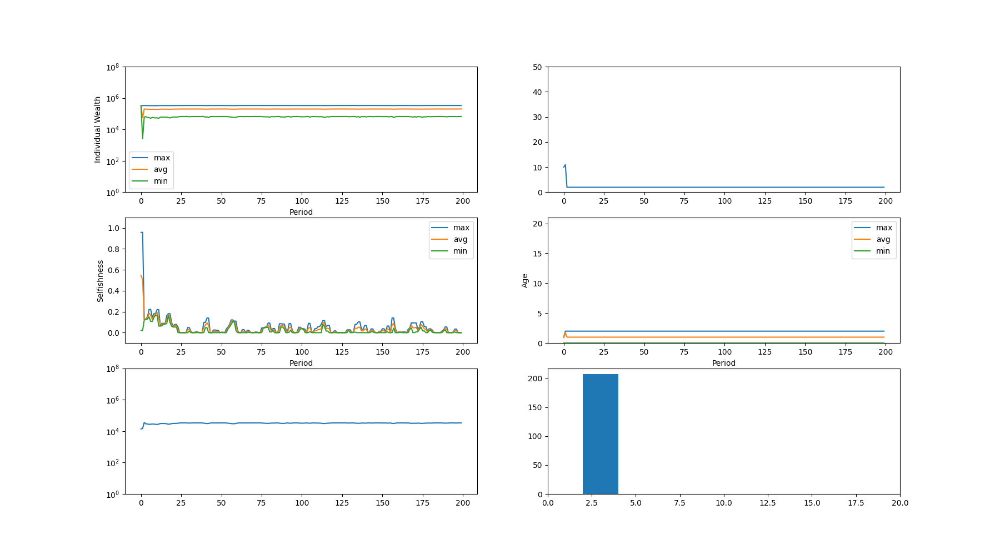
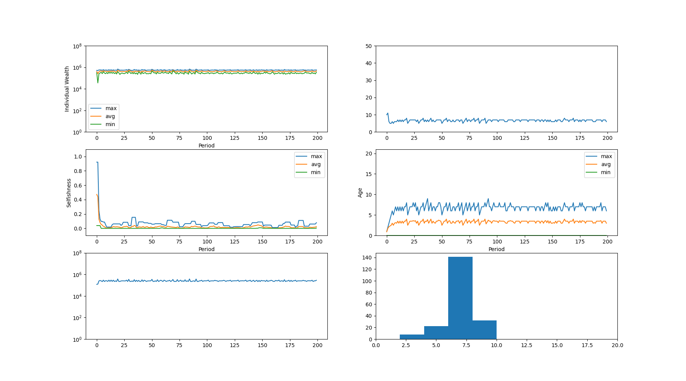

#### Results

commit: `20a083d02ec3d96ac5fb3074580071dcf14484be`

Base params:

```python
id_gen = common.SequentialIdentityGenerator()
recruitment_strategy = models.recruitment.AverageOfTopContributors(
    identity_generator=id_gen, percentile=0.1
)
strategy = models.DefaultWorldStrategy(
    reward_distribution_strategy=models.EqualContribution(),
    recruitment_strategy=recruitment_strategy,
    identity_generator=id_gen,
)

fiscal_length = 365

world_seed = framework.WorldSeed(
    initial_people={
        framework.PersonSeed(
            identity=id_gen.generate(), selfishness=random.random()
        )
        for _ in range(10)
    },
    fiscal_length=fiscal_length,
    productivity=0.75,
    initial_individual_wealth=600_000,
    daily_salary=300_000 / 365,
    daily_living_cost=600_000 / 365,
    periodic_recruit_count=1,
    max_age=fiscal_length * 20,
)
```

I tried varying the productivity (the multiplier for org profits). Here are the results:

<details>
<summary>productivity = 0.1</summary>

</details>

<details>
<summary>productivity = 0.25</summary>

</details>

<details>
<summary>productivity = 0.5</summary>

</details>

<details>
<summary>productivity = 0.75</summary>

</details>

<details>
<summary>productivity = 1.0</summary>

</details>

#### Conclusions and further questions

Low productivity means that less money is brought into the world (the Org), which means there is less money available to distribute to people. This seems to be a reasonable explanation for the fact that:
1. Population is lower with low productivity
2. People's "bonuses" stay more or less the same regardless of productivity.

I'd like to make people behave a bit smarter. Right now the only thing influencing a person's decision on how to act is a random number, but what if I gave them information about other things? The total reward available in the org? Their age? Other people's info?

**I should implement a framework that can cleanly express the "inputs" to a person's decision, as well as the way they make it.**
